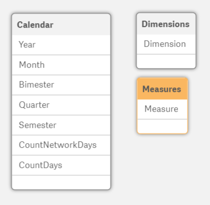
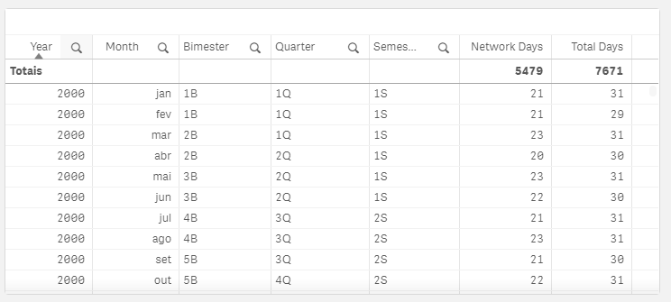

# Customize and Export data with Simple or Pivot Table
To demonstrate this functionality, we will create a sample calendar table.\
Follow this steps:

## Step One - Creating sample calendar table.
This table is only to demonstrate.

```
//Brazilian date format DD/MM/YYYY
LET vStartDate 	= Num(Date(‘01/01/2000’)); 
LET vEndDate 	= Num(Date(‘31/12/2020’));    

Calendar:
LOAD
   Year(Date) AS Year
  ,Month(Date) AS Mês
  ,Ceil(Num(Month(Date))/2) & ‘B’ AS Bimester
  ,Ceil(Num(Month(Date))/3) & ‘Q’ AS Quarter
  ,ceil(Num(Month(Date))/6) & ‘S’ AS Semester
  ,NetWorkDays(Date, Date) AS CountNetworkDays
  ,1 AS CountDays
;
LOAD Date($(vStartDate) + IterNo() -1) AS Date
AutoGenerate 1 While ($(vStartDate) + IterNo() -1) <= $(vEndDate);
```

## Step Two - Create dimension and measure tables.
This tables will define who columns will be shown in export table.

```
[Dimensions]:
Load * Inline [
  Dimension
  1 – Year
  2 – Month
  3 – Bimester
  4 – Quarter
  5 – Semester
];

[Measures]:
Load * Inline [
  Measure
  1 – NetWork Days
  2 – Total Days
];
```
>NOTE: The number before dimension and measure title is to prevent conflict in show/hide conditions.

After load the script, you will see a data model like this:\


## Step Three - Include a Filter and Simple Table
Include a Filter Pane and add **Dimension** and **Measure** dimensions.\
Include a Simple Table and add **Year**, **Month**, **Bimester**, **Quarter** and **Semester** dimensions.\
Include **NetWork Days** and **Total Days** like measures.\
- Sum(CountNetworkDays)
- Sum(CountDays)

You should have a table like this:\


## Step Four - Add show condition into column properties.
For each dimension and measure, you will insert a condition to show/hide the column from table.\
To do this, edit your app and click on the table then expand all dimensions and measures and set the show/hide condition.\
Each dimension has yout own condition line below.

**Dimensions:**
```
IF(GetSelectedCount([Dimension]) = 0, 0, SubStringCount('|' & Concat([Dimension], '|') & '|', '1 - Year'))
IF(GetSelectedCount([Dimension]) = 0, 0, SubStringCount('|' & Concat([Dimension], '|') & '|', '2 - Month'))
IF(GetSelectedCount([Dimension]) = 0, 0, SubStringCount('|' & Concat([Dimension], '|') & '|', '3 - Bimester'))
IF(GetSelectedCount([Dimension]) = 0, 0, SubStringCount('|' & Concat([Dimension], '|') & '|', '4 - Quarter'))
IF(GetSelectedCount([Dimension]) = 0, 0, SubStringCount('|' & Concat([Dimension], '|') & '|', '5 - Semester'))
```
**Measures:**
```
IF(GetSelectedCount([Measure]) = 0, 0, SubStringCount('|' & Concat([Measure], '|') & '|', '1 - NetWork Days'))
IF(GetSelectedCount([Measure]) = 0, 0, SubStringCount('|' & Concat([Measure], '|') & '|', '2 - Total Days'))
```

You should have a table like this:\

