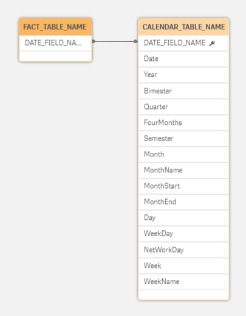
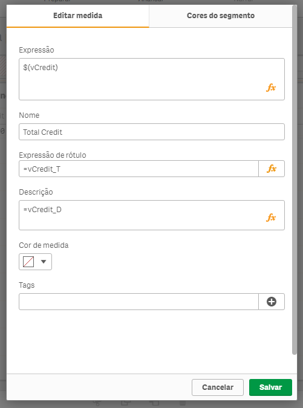

# Scripts
Multpurpose Qlik Sense and Qlik View Scripts

## Create a Calendar Table from another Table.
Create a master calendar from another table dynamically.

**Instructions**

This script gets the dates from a 'Resident' table, therefore, the source table must be in memory.

1. Include the *AutomaticCalendar.inc* file in the script after loading the table containing the dates that will be used as the basis for generating the calendar table;
2. Configure the source and destination parameters (see examples below).

**Settings:**

- *vTableTable* - Name of the 'Resident' table that contains the date field;
- *vCampoDataOrigem* - Name of the 'Resident' table field that contains the dates;
- *vTabelaDestino* - Name of the final calendar table;
- *vCampoDataDestino* - Name of the 'Key' field of the final calendar table;
- *vAutoCompletar* - Fill the missing dates (0 - Do not complete | 1 - Complete).

**Usage:**

```
[FACT_TABLE_NAME]:
LOAD 
  DATE_FIELD_NAME, 
  ... 
FROM ...

LET vTabelaOrigem     = 'FACT_TABLE_NAME';
LET vCampoDataOrigem  = 'DATE_FIELD_NAME';
LET vTabelaDestino    = 'CALENDAR_TABLE_NAME';
LET vCampoDataDestino = 'DATE_FIELD_NAME';
LET vAutoCompletar    = 0;  

$(Include=Libname/AutomaticCalendar.inc);

Store [CALENDAR_TABLE_NAME] into [lib://Libname/Folder/MastarCalendar.qvd](qvd);
Drop Field [CALENDAR_TABLE_NAME];
```

**Result:**




## Load Measures from XLS file.
Load measures from a sheet file and use into master items.

**Instructions**

1. Fill and load the sheet file with measures (See the example [sheet file here](MeasuresFromFile/Expressions.xlsx)).
2. Load [MeasuresFromFile.qvs](MeasuresFromFile/MeasuresFromFile.qvs);
2. And set master items for each measure like this example

**Settings:**

Include master measure item and set the prperties:

	- Expression: $(vVariableName_E)
	- Expression label: =vVariableName_T
	- Description: =vVariableName_D



## Masks.
Creat masks in multiple data types.

**Instructions**

1. Download mask.inc file;
2. Include into you project app;

**Usage:**

```
[TABLE]:
LOAD 
  $(vMascaraCPF(CPF_FIELD)) AS CPF, // 00000000000 -> 000.000.000-00
  ... 
FROM ...
```

## Validations.
Validate multiple data types.

**Instructions**

1. To validate CPF, uses cpf.qvs file;
2. To validate CNPJ, uses cpf.qvs file;

Download example: [CPF_CNPJ.qvf](Validations/cpf_cnpj.qvf);
