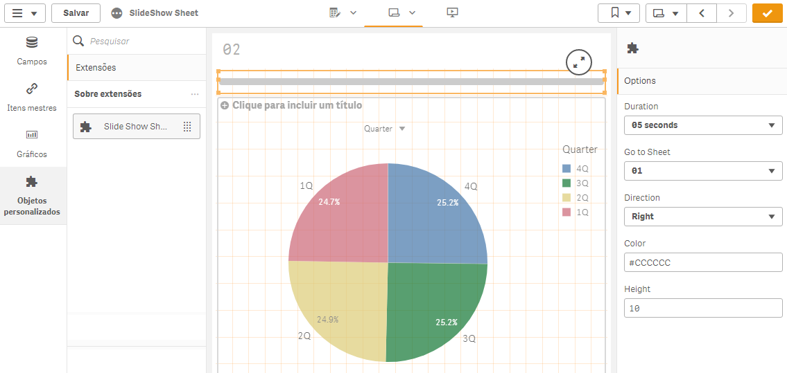

# Turn your Qlik Sense® App into a Slideshow for Presentation.
Each worksheet will be displayed for the time that is determined, then navigate to the next worksheet.

## Step One - Download this Extension
Download all files extension.

## Step Two - Install Extension.
If you don't know how to install extension, see in [Qlik Help](https://help.qlik.com/en-US/sense-developer/September2020/Subsystems/Extensions/Content/Sense_Extensions/CustomComponents/custom-components-installing.htm)

## Step Three - Open you App and Include Timers
- Include one extension object into each sheet app;
- Configure 
  - **Duration:** How long will be the duration of current slide;
  - **Go to sheet:** What is the next sheet to show;
  - **Direction:** The progressba direction (Left/Right);
  - **Color:** Progressbar background color;
  - **Height:** Progressbar height.  

>NOTE: You must include one timer inside each sheet that you want do slide.

## Download
You can download this [qvf example here](example/SlideShowSheet.qvf).
